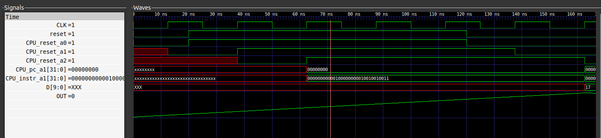
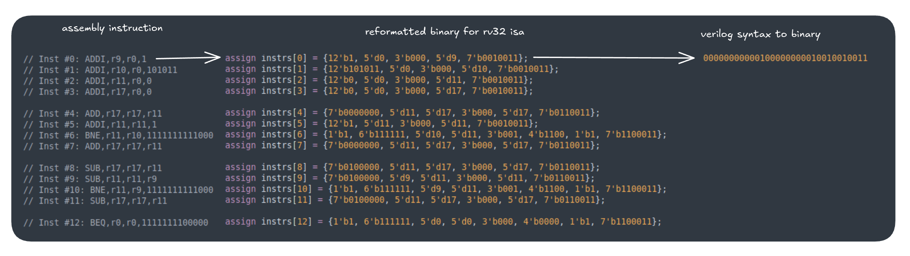
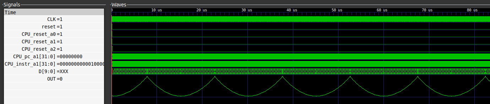

# Labs (Hands-on Functional Modelling)

## Compilation steps

1. clone the BabySoC project repo
  
     `git clone https://github.com/manili/VSDBabySoC`
  
2. Compile the repo using iverilog
  
   `cd VSDBabySoC`
    
   `iverilog -o output/pre_synth_sim/pre_synth_sim.out -DPRE_SYNTH_SIM -I src/include -I src/module src/module/testbench.v`
   
    NOTE: rvmyth.v is not available in the repo, it needs to be compiled with `sandpiper-saas`. more info on this issue at [issues/28](https://github.com/vsdip/IndiaRiscvTapeoutProgram/issues/28#issuecomment-3360766537).
    
   `output/pre_synth_sim/pre_synth_sim.out`
    
3. View the waveform

   `gtkwave pre_synth_sim.vcd` 
    

## Waveform analysis

  
PC_a1 resets to 0 and stays at 0 as long as reset_a2 is asserted. The reset being fed to the PC is synchronous. Upon deassertion of reset, the PC starts executing each instruction in the imem.

The first instruction is decoded below:

  

The instruction matches the CPU_instr_a1 signal in the gtkwave window. The DAC gets a initial value of 17 (decimal) since all xregs are initialised to their index values upon reset and the data port of DAC consumes the xreg17s values.

The behaviour of the DAC is shown below:

  

It is evident from the assembly program that the value in xreg17 incremented expotentially till r11 reached 43, then it decreased exponentially till it reaches 0.

The bitstoreal output of DAC is shown in the waveform as well.